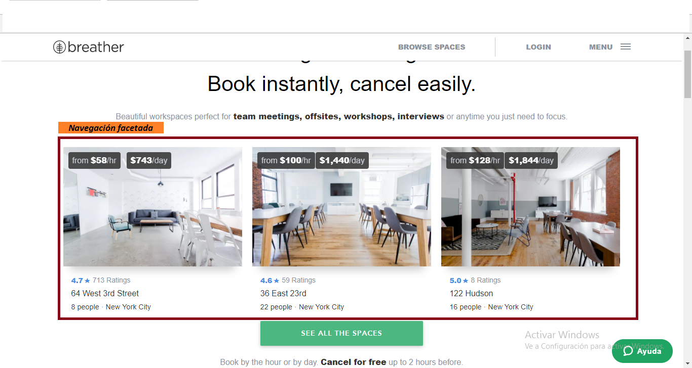
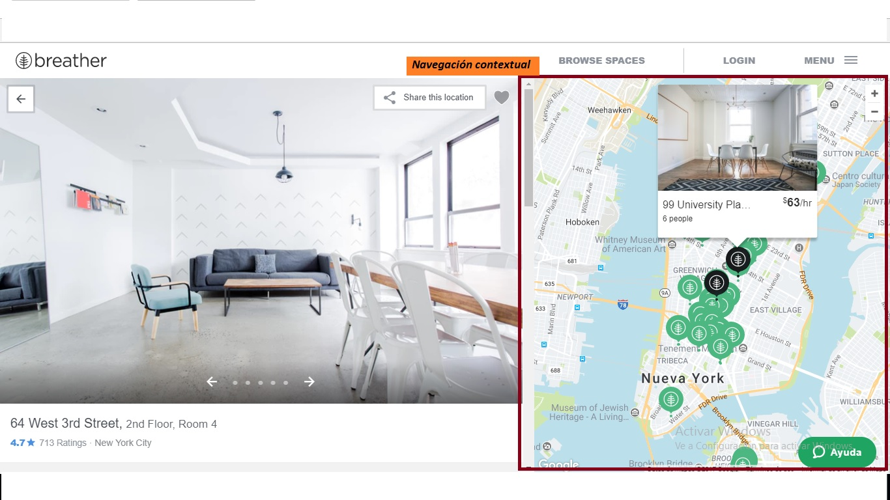
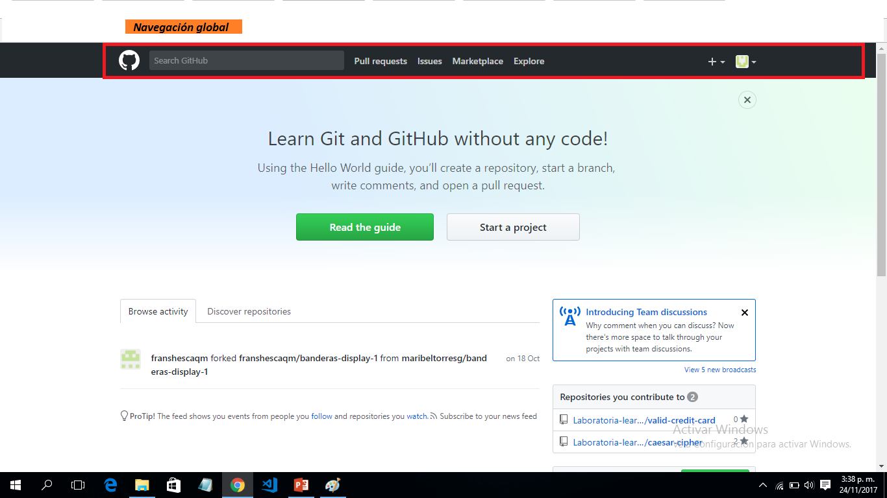
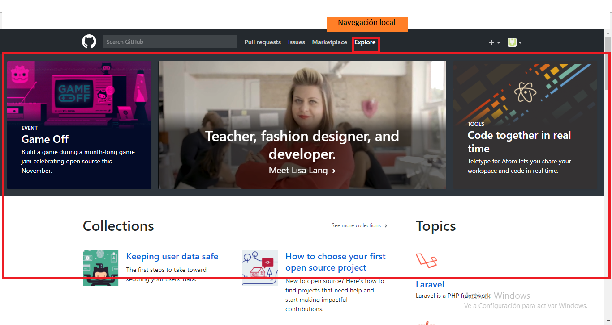
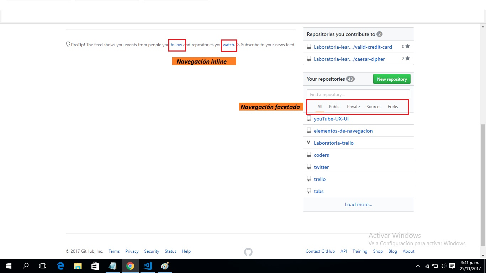
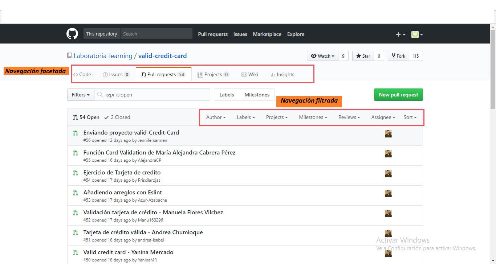
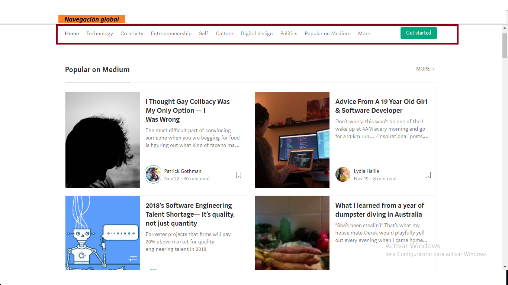
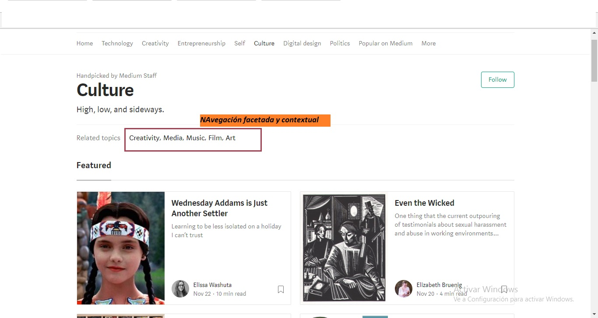

# Breather
## Objetivo 
Identificar los elementos de navegación en la página web de Breather.
***

***

***

***

# GitHub 
## Objetivo
Identificar los elementos de navegación.

***

***

***

# Medium
## Objetivo
Identificar los elementos de navegación en la página de Medium.

***

